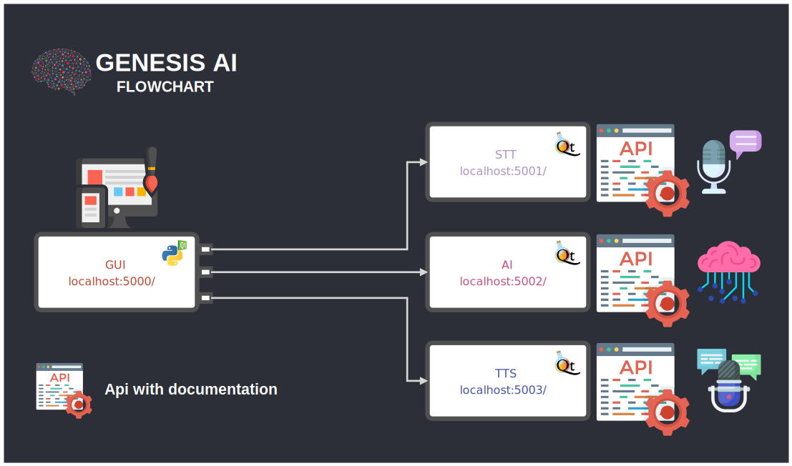

GENESIS AI
==========



### Run:
```
docker pull python:3.9-slim && \
docker pull python:3.7-slim && \
git clone https://github.com/Martin1403/Genesis.git && \
cd Genesis && \
xhost + && \
docker-compose up --build && \
docker-compose down && \
docker rmi $(docker images --format="{{.ID}}" genesis_*) --force && \
docker volume prune
```
###### Ctrl+C to exit.

**Note:** Ready to test but still in development, any ideas? Do not hesitate to contact...
Need to install manually docker-compose does not work yet. 
